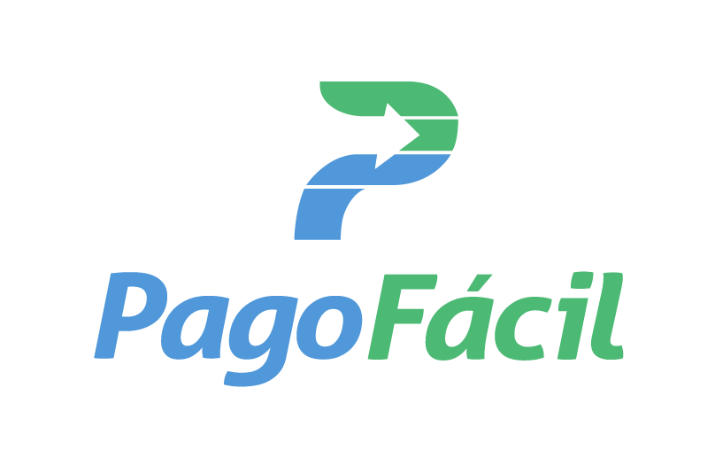

<p align="center">
  <a href="" rel="noopener">
 </a>
</p>

<h3 align="center">@pagofacil/pagofacil-sdk-javascript-examples</h3>

<div align="center">

[]()
[](https://github.com/kylelobo/The-Documentation-Compendium/issues)
[](https://github.com/kylelobo/The-Documentation-Compendium/pulls)
[](/LICENSE)

</div>

---

<p align="center"> Algunos ejemplos en Javascript para demostrar el uso del SDK.
    <br> 
</p>

## 📝 Table of Contents

- [Sobre el proyecto](#about)
- [Instrucciones](#getting_started)
- [Instalación](#install)
- [Ejecutando los ejemplos](#usage)
- [Construido con](#built_using)
- [Authors](#authors)


## 🧐 About <a name = "about"></a>

La idea de este proyecto es minimizar la puesta en marcha de los desarrolladores e integradores que quieran usar el API de Pago Fácil para poder desarrollar sus productos y servicios usando nuestra tecnología.

## 🏁 Instrucciones <a name = "getting_started"></a>

Estas instrucciones harán que obtengas una copia local del proyecto para que puedas hacer pruebas con la API. La idea es que los uses de referencia para poder crear tu proyecto.


### Requisitos

Los ejemplos usan distintas librerías que hacen más sencillo el desarrollo, sin embargo las dos librerías que se requieren para poder usar nuestras APIs y el firmado de los mensajes son las siguientes :

```
npm install @pagofacil/api_pago_facil @pagofacil/sdk-apis-javascript-signature --save
```

Los ejemplos usan variables de entorno para la configuración. El SDK de Pago Fácil revisa si existe la variable de entorno STAGE, y si su valor es dev apuntará al servidor de desarrollo. Cualquier otro valor o si no existe apuntará por defecto al servidor de producción.


### Instalación de los ejemplos de manera local. <a name = "install"></a>

#### Clonando el repositorio

```
git clone git@github.com:PSTPAGOFACIL/pagofacil-sdk-javascript-examples.git
```

#### Descargando la última versión

Puedes descargar siempre la última versión del tutorial haciendo click en el siguiente link : https://github.com/PSTPAGOFACIL/pagofacil-sdk-javascript-examples/archive/master.zip

Para bajarlo desde una consola Unix puedes ejecutar el siguiente comando

```
wget https://github.com/PSTPAGOFACIL/pagofacil-sdk-javascript-examples/archive/master.zip
```

### Instalando dependencias

Ejecutamos el siguiente comando en el root del proyecto.


## 🎈 Ejecutando los ejemplos <a name="usage"></a>

Para ejecutar los ejemplos debes de primero copiar el archivo .env.examples al archivo .env y llenar con tus datos para ejecutar los siguientes scripts

### Authenticar el usuario

Retorna las credenciales necesarias para poder generar las consultas futuras

```bash
node examples/login.js
```

### Crear una transacción

Genera una transacción con los datos del servicio asociado. Retorna las distintas urls para pagar con los distintos medios de pago.

```bash
node examples/createTrx.js
```


## ⛏️ Construido usando <a name = "built_using"></a>

- [NodeJs](https://nodejs.org/en/) - Server Environment
- [Pago Fácil Javascript SDK](https://github.com/PSTPAGOFACIL/sdk-apis-javascript) - Librería / SDK de Pago Fácil para javascript/NodeJS
- [Pago Fácil Signature Library](https://github.com/PSTPAGOFACIL/sdk-apis-javascript-signature) - Librería / SDK de Pago Fácil para firmar las consultas para javascript/NodeJS

## ✍️ Authors <a name = "authors"></a>

- [@ctala](https://github.com/ctala) - Idea & Initial work

